# Aplikasi Manajemen Laundry — PRD & ERD Fase 1

**Stack:** Laravel + SQLite (dapat diganti PostgreSQL)
**Role:** Owner, Staff
**Fase:** 1 — Single Outlet MVP

---

## 1. Latar Belakang & Tujuan

Aplikasi untuk mengelola operasional bisnis laundry sehari-hari: input order, tracking status cucian, pembayaran manual, dan laporan omzet. Dibangun bertahap: Fase 1 untuk 1 outlet, kemudian multi-outlet (Fase 2) dan paket langganan + payment gateway (Fase 3).

---

## 2. Role & Hak Akses

| Role  | Akses |
|-------|-------|
| **Owner** | Full access: kelola user/staff, lihat semua laporan & omzet, kelola layanan & harga |
| **Staff** | Input order baru, update status order, input pembayaran, cetak nota, lihat order harian (tidak bisa lihat laporan omzet/keuangan) |

---

## 3. Pembagian Fase

### **Fase 1 — MVP (Single Outlet)**
Fokus: operasional inti laundry jalan dulu.

**Fitur:**
- Login & manajemen user (Owner bisa tambah/nonaktifkan Staff)
- Master data layanan (jenis cuci: cuci kering, cuci setrika, cuci express, dll) + satuan (kg/item) + harga
- Manajemen pelanggan (nama, no. HP, alamat — bisa dibuat on-the-fly saat input order)
- Input order/transaksi laundry:
  - Pilih/buat pelanggan
  - Tambah item layanan + qty/berat → sistem hitung subtotal & total otomatis
  - Estimasi selesai
- Tracking status order: `Diterima → Proses Cuci → Progres Setrika → Siap Diambil → Selesai/Diambil`
- Pembayaran manual: cash/transfer, status `Belum Bayar / DP / Lunas`
- Cetak nota (struk order)
- Dashboard ringkas: omzet hari ini, jumlah order aktif, order siap diambil
- Laporan sederhana: omzet harian/bulanan, riwayat transaksi (filter tanggal)

### **Fase 2 — Multi-Outlet**
- CRUD data outlet (nama, alamat, kontak)
- User (staff) dikaitkan ke 1 outlet; Owner bisa lihat semua outlet
- Semua data transaksional (pelanggan, order, pembayaran) di-scope per outlet
- Dashboard & laporan: per outlet + konsolidasi semua outlet (khusus Owner)

### **Fase 3 — Langganan & Payment Gateway**
- Paket langganan pelanggan (misal: langganan bulanan X kg/bulan dengan harga khusus)
- Riwayat & status langganan pelanggan (aktif/expired, sisa kuota)
- Integrasi payment gateway (Midtrans/Xendit) untuk pembayaran order secara online
- Notifikasi WhatsApp/email: order siap diambil, reminder langganan mau habis

---

## 4. Entity Relationship Diagram (ERD)

Skema dirancang supaya kolom `outlet_id` sudah disiapkan dari awal (nullable/default 1 di Fase 1), jadi migrasi ke Fase 2 tidak perlu ubah struktur besar-besaran.

```mermaid
erDiagram
    USERS ||--o{ ORDERS : "menangani"
    OUTLETS ||--o{ USERS : "memiliki staff"
    OUTLETS ||--o{ ORDERS : "memiliki"
    CUSTOMERS ||--o{ ORDERS : "membuat"
    ORDERS ||--|{ ORDER_ITEMS : "berisi"
    SERVICES ||--o{ ORDER_ITEMS : "dipakai di"
    ORDERS ||--o{ PAYMENTS : "dibayar via"
    CUSTOMERS ||--o{ SUBSCRIPTIONS : "berlangganan"
    SUBSCRIPTION_PACKAGES ||--o{ SUBSCRIPTIONS : "dipilih di"
    PAYMENTS ||--o| PAYMENT_GATEWAY_TX : "dicatat di"

    USERS {
        bigint id PK
        bigint outlet_id FK "nullable - Fase 2"
        string name
        string email
        string password
        enum role "owner, staff"
        boolean is_active
        timestamps created_at_updated_at
    }

    OUTLETS {
        bigint id PK
        string name
        string address
        string phone
        boolean is_active
    }

    CUSTOMERS {
        bigint id PK
        string name
        string phone
        string address
        timestamps created_at
    }

    SERVICES {
        bigint id PK
        string name
        enum unit "kg, item"
        decimal price
        boolean is_active
    }

    ORDERS {
        bigint id PK
        bigint outlet_id FK "nullable - Fase 2"
        bigint customer_id FK
        bigint user_id FK "staff yang input"
        string order_code
        enum status "diterima, cuci, setrika, siap_diambil, selesai"
        enum payment_status "belum_bayar, dp, lunas"
        decimal total_price
        date estimated_done
        timestamp finished_at
        timestamps created_at
    }

    ORDER_ITEMS {
        bigint id PK
        bigint order_id FK
        bigint service_id FK
        decimal qty
        decimal price
        decimal subtotal
    }

    PAYMENTS {
        bigint id PK
        bigint order_id FK
        decimal amount
        enum method "cash, transfer"
        timestamp paid_at
    }

    SUBSCRIPTION_PACKAGES {
        bigint id PK
        string name
        decimal price
        decimal quota_kg
        int duration_days
        boolean is_active
    }

    SUBSCRIPTIONS {
        bigint id PK
        bigint customer_id FK
        bigint package_id FK
        date start_date
        date end_date
        decimal remaining_quota
        enum status "aktif, expired, dibatalkan"
    }

    PAYMENT_GATEWAY_TX {
        bigint id PK
        bigint payment_id FK
        string gateway "midtrans, xendit"
        string reference_id
        enum status "pending, success, failed"
        json raw_response
    }
```

**Tabel dipakai per fase:**
- **Fase 1:** `users`, `customers`, `services`, `orders`, `order_items`, `payments` (`outlet_id` di-nullable dulu / default outlet tunggal)
- **Fase 2:** tambah `outlets`, isi `outlet_id` di `users` & `orders`
- **Fase 3:** tambah `subscription_packages`, `subscriptions`, `payment_gateway_tx`

---

## 5. Alur Utama (Fase 1)

1. Staff login → buka menu "Order Baru"
2. Cari/buat pelanggan → pilih layanan + qty/berat → sistem hitung total
3. Order tersimpan dengan status `Diterima`
4. Staff update status sesuai progres cucian
5. Saat pelanggan ambil: input pembayaran → status order jadi `Selesai`
6. Owner pantau dashboard omzet & laporan kapan saja

---

## 6. Non-Functional Requirements
- Laravel + Blade/Livewire (sesuai stack yang biasa digunakan), bisa manfaatkan Filament untuk admin panel biar hemat waktu development
- SQLite sebagai database dulu (dapat migrasi ke PostgreSQL ke Fase 2)
- Struktur database dari awal sudah antisipasi Fase 2 & 3 (kolom `outlet_id` nullable, tabel langganan & payment gateway terpisah) supaya tidak perlu migrasi besar nanti
- Autentikasi & otorisasi berbasis role (bisa pakai package seperti `spatie/laravel-permission` kalau role makin kompleks ke depan)

---

## 7. Next Step
Setelah PRD & ERD disetujui, urutan build yang disarankan untuk Fase 1:
1. Setup project Laravel + migration sesuai ERD Fase 1
2. Auth + role (owner/staff)
3. CRUD master data (services, customers)
4. Modul order (create, update status, item)
5. Modul pembayaran + cetak nota
6. Dashboard & laporan

---

## 8. Teknis Implementasi (Sudah Selesai)

### Database Migration — 6 Tabel

| Tabel | Kolum Kunci |
|-------|-------------|
| `users` | `id` (bigint auto-increment PK), `outlet_id` (integer nullable default 1), `name`, `email` (unique), `password`, `role` (enum: owner/staff), `is_active` (boolean default true), `timestamps` |
| `customers` | `id` (bigint auto-increment PK), `name`, `phone` (string nullable), `address` (string nullable), `timestamps` |
| `services` | `id` (bigint auto-increment PK), `name` (string), `unit` (enum: kg/item), `price` (decimal 10,2), `is_active` (boolean default true), `timestamps` |
| `orders` | `id` (bigint auto-increment PK), `outlet_id` (integer nullable default 1), `customer_id` (integer FK), `user_id` (integer FK - staff yang input), `order_code` (string unique), `status` (enum: diterima/cuci/setrika/siap_diambil/selesai), `payment_status` (enum: belum_bayar/dp/lunas), `total_price` (decimal 10,2), `estimated_done` (date nullable), `finished_at` (timestamp nullable), `timestamps` |
| `order_items` | `id` (bigint auto-increment PK), `order_id` (integer FK), `service_id` (integer FK), `qty` (decimal 10,2), `price` (decimal 10,2), `subtotal` (decimal 10,2), `timestamps` |
| `payments` | `id` (bigint auto-increment PK), `order_id` (integer FK unique), `amount` (decimal 10,2), `method` (enum: cash/transfer), `paid_at` (timestamp nullable), `timestamps` |

### Seed Data (sudah dijalankan)
- 5 services: Cuci Kering (5000/kg), Cuci Setrika (3000/kg), Cuci Express (15000/item), Cucian Khusus (20000/item), Pengeringan (2000/kg)
- 2 users: owner@laundry.test (role: owner, is_active: true) & staff@laundry.test (role: staff, is_active: true), password: `password123`

### Database Sudah Dibuat dan Terisi
- `php artisan migrate --force` sukses — 6 tabel terbuat di `database/database.sqlite`
- `php artisan db:seed --force` sukses — data services + 2 users tersimpan

### Auth & Routes
- `Auth::routes()` terdaftar di `routes/web.php`
- Login/register views sudah di-generate oleh `laravel/ui:auth`
- Route `/dashboard` sudah ditambahkan untuk redirect setelah login

### Git Status
- Project sudah di-init git di ` /home/aoi2/DEV/project/laundry-app`
- Branch saat ini: `main`
- Remote origin: `git@github.com:andywijaya15/laundry-app.git`
- working directory clean — nothing to commit

---

## 9. Catatan Penting untuk Pengembangan Selanjutnya

1. **Database**: Saat ini menggunakan SQLite (`database/database.sqlite`). Untuk produksi atau Fase 2 (multi-outlet), migrasi ke PostgreSQL direkomendasikan.

2. **Branch Strategy**: 
   - Work ini sedang dijalankan di branch `main`
   - Untuk pengembangan fitur baru, disarankan membuat branch baru dari `main` (contoh: `feature/order-management`, `feature/auth-role`, dll)
   - Setelah fitur selesai, bisa merge ke `main` atau dibuang jika tidak diperlukan

3. **Role Middleware**: Implementasi manual dengan enum `role` di table `users`. Middleware `role` sudah didefinisikan di `app/Http/Middleware/RoleMiddleware.php` untuk enkapan akses per role.

4. **Frontend**: Sekarang menggunakan Blade views dengan Tailwind CSS (dari laravel/ui:auth scaffolding). Bisa dipindah ke Livewire/components nanti jika butuh interaktivitas lebih.

5. **Seed data**: Services dan users sudah di-seed. Untuk development baru, bisa menjalankan `php artisan db:seed --force` lagi atau membuat seeder yang lebih lengkap.

6. **Migration files**: Ada di `database/migrations/` dengan nama:
   - `0001_01_01_000000_create_users_table.php` (bawaan Laravel, sudah diperluas kolom)
   - `0001_01_01_000001_create_cache_table.php` (bawaan Laravel)
   - `0001_01_01_000002_create_jobs_table.php` (bawaan Laravel)
   - `2026_09_18_140956_create_customers_table.php`
   - `2026_09_18_140957_create_services_table.php`
   - `2026_09_18_140958_create_orders_table.php`
   - `2026_09_18_140959_create_order_items_table.php`
   - `2026_09_18_141000_create_payments_table.php`
   - `2026_09_18_142557_add_outlet_id_role_is_active_to_users_table.php`

---

*Documentasi ini dibuat untuk proyek Aplikasi Manajemen Laundry Fase 1.*
*Untuk melanjutkan pengembangan, lakukan `git checkout -b nama-branch-fitur` dari branch main terlebih dahulu.*